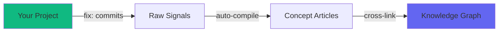

# Knowledge Graph

> Auto-maintained by PikaKit Knowledge Compiler. Do not edit manually.
> Last updated: —

---

## Concept Relationships

_No concepts yet. As the knowledge compiler processes signals and creates concept articles, their relationships will be visualized here._

---

## How It Works

1. **Git Scanner** (Phase 0.5) detects `fix:` and `feat:` commits with qualifying changes
2. Generates **raw signals** in `raw-signals/SIG-{NNN}.md`
3. When uncompiled count > 5, **auto-compiles** related signals into concept articles
4. Concept articles are cross-linked and visualized in this graph

---

> ⚡ PikaKit Knowledge Compiler v3.9.206
