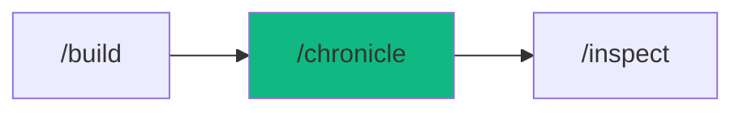

# /chronicle - Documentation Engine

$ARGUMENTS

---

## Purpose

Generate comprehensive project documentation automatically by analyzing source code, extracting types, and producing structured docs. **Differs from `/inspect` (code review and quality audit) and `/plan` (task breakdown) by focusing on written documentation — README, API specs, ADR, component docs, ops runbooks, and inline comments.** Uses `doc-templates` for all doc generation, with `doc-templates` and `copywriting` for structure and tone.

---

## 🤖 Meta-Agents Integration

| Phase | Agent | Action |
| ----- | ----- | ------ |
| **Pre-Flight** | `assessor` | Evaluate documentation scope and knowledge-compiler context |
| **Execution** | `orchestrator` | Assign domain agents for doc generation |
| **Safety** | `recovery` | Save state and recover from file modification failures |
| **Post-Chronicle** | `learner` | Log doc patterns and templates for reuse |

```
Flow:
assessor.evaluate(doc_scope) → identify coverage gaps
       ↓
analyze codebase → generate docs per sub-command
       ↓
learner.log(templates, patterns)
```

---

## Sub-Commands

| Command | Purpose | Output |
|---------|---------|--------|
| `/chronicle` | Full documentation suite | All doc types below |
| `/chronicle readme` | Generate/update README.md | `README.md` |
| `/chronicle api` | API documentation (OpenAPI) | `docs/api.yaml` |
| `/chronicle inline` | Add inline code comments (JSDoc/TSDoc) | Source file annotations |
| `/chronicle adr` | Architecture Decision Record | `docs/adr/NNN-title.md` |
| `/chronicle storybook` | Component documentation | Story files |
| `/chronicle runbook` | Ops runbook | `docs/runbooks/*.md` |
| `/chronicle changelog` | Generate CHANGELOG.md | `CHANGELOG.md` |
| `/chronicle [file-path]` | Document specific file | File annotations |

---

## ⚡ MANDATORY: Documentation Generation Protocol


### Phase 0: Dynamic Skill Detection

> **Protocol:** `.agent/rules/dynamic-skill-detection.md`

1. Scan `$ARGUMENTS` for domain signals (case-insensitive).
2. Match signals against the Domain Signal → Skill Mapping table.
3. Inject matched skills (max 5, priority: High > Medium > Low) into active skill set.
4. Skip skills already in workflow defaults.
5. Announce injected skills:

```
[⚡PikaKit] Dynamic Skills Detected:
  + {skill-name} (signal: "{matched keywords}")
  Base skills: [workflow defaults]
  Total active: [count]
```


### Phase 0.5: Auto-Knowledge Ingest (Git Scanner)

> **Protocol:** `.agent/rules/auto-knowledge-ingest.md`
> **Channel 1:** Scans recent git commits for project-specific lessons.

```
1. Check if .agent/knowledge/ exists — if not, skip
2. Read _index.md → get last_git_scan SHA
3. Run: git log --since="7 days ago" --grep="^fix:\|^feat:" -n 20
4. For qualifying commits (≥2 files changed OR keywords: fallback, guard, CORS, rate-limit):
   a. Skip if signal with same commit SHA exists
   b. Generate signal to raw-signals/SIG-{NNN}.md
5. Update last_git_scan in _index.md
6. If uncompiled signals > 5 → auto-compile (max 10 per batch)
```
### Phase 1: Pre-flight & knowledge-compiler Context

> **Rule 0.5-K:** knowledge-compiler pattern check.

1. Read `.agent/skills/knowledge-compiler/patterns/` for past failures before proceeding.
2. Trigger `recovery` agent to run Checkpoint (`git commit -m "chore(checkpoint): pre-chronicle"`).

### Phase 2: Codebase Analysis

| Field | Value |
|-------|-------|
| **INPUT** | $ARGUMENTS (sub-command + optional scope) |
| **OUTPUT** | Documentation scope: files to document, gaps identified, doc type |
| **AGENTS** | `doc-templates`, `assessor` |
| **SKILLS** | `context-engineering`, `knowledge-compiler` |

// turbo — telemetry: phase-2-analysis

1. Scan project structure and identify:
   - Source files and their exports
   - API routes and endpoint definitions
   - Component files and their props
   - Existing documentation (for update vs create)
2. `assessor` evaluates coverage gaps
3. Determine documentation scope based on sub-command (mapped from Phase 1 inputs)

### Phase 3: Documentation Generation

| Field | Value |
|-------|-------|
| **INPUT** | Scope analysis from Phase 2 |
| **OUTPUT** | Generated documentation files |
| **AGENTS** | `doc-templates`, `orchestrator` |
| **SKILLS** | `doc-templates`, `copywriting` |

// turbo — telemetry: phase-3-generate

Generate docs based on sub-command:

**README.md** — Extract from code:
```markdown
# Project Name
> One-line description
## Features
## Quick Start (Prerequisites, Installation, Environment)
## Architecture
## API Reference
## Contributing
## License
```

**API Documentation** — Source-to-spec:

| Source | Tool | Output |
|--------|------|--------|
| Express/Fastify | swagger-autogen | OpenAPI 3.1 |
| tRPC | trpc-openapi | OpenAPI 3.1 |
| GraphQL | Introspection | Schema docs |
| FastAPI | Built-in | Auto-generated |

**ADR** — Decision records:
```markdown
# ADR-NNN: [Decision Title]
## Status: Accepted | Date: YYYY-MM-DD
## Context (why the decision was needed)
## Decision (what was chosen)
## Consequences (trade-offs: → pros, ❌ cons)
## Alternatives Considered (comparison table)
```

**Inline Comments** — JSDoc/TSDoc annotations for exported functions, classes, and types.

**Runbooks** — Operational procedures:
```markdown
# Runbook: [Scenario]
## Severity: P1/P2/P3
## Impact: [User-facing effect]
## Diagnosis (step-by-step investigation)
## Resolution (fix steps with commands)
## Prevention (monitoring + alerts)
```

### Phase 4: Verification & Coverage

| Field | Value |
|-------|-------|
| **INPUT** | Generated docs from Phase 3 |
| **OUTPUT** | Coverage report: documented vs total, gaps remaining |
| **AGENTS** | `doc-templates`, `learner` |
| **SKILLS** | `doc-templates`, `problem-checker`, `knowledge-compiler` |

// turbo — telemetry: phase-4-verify

1. Verify all generated docs are valid markdown
2. Check documentation coverage:
   - Functions documented vs total
   - API endpoints documented vs total
   - Components with stories vs total
3. Log templates and patterns via `learner`

---

## → MANDATORY: Problem Verification Before Completion

> **CRITICAL:** This check MUST be performed before any `notify_user` or task completion.

### Check @[current_problems]

```
1. Read @[current_problems] from IDE
2. If errors/warnings > 0:
   a. Auto-fix: imports, types, lint errors
   b. Re-check @[current_problems]
   c. If still > 0 → STOP → Notify user
3. If count = 0 → Proceed to completion
```

### Auto-Fixable

| Type | Fix |
|------|-----|
| Missing import | Add import statement |
| Invalid JSDoc | Fix annotation syntax |
| Lint errors | Run eslint --fix |

> **Rule:** Never mark complete with errors in `@[current_problems]`.

---


---

## MANDATORY: Post-Completion Knowledge Check

> **Protocol:** `.agent/rules/auto-knowledge-ingest.md`
> **Channel 2:** AI self-reflects on session to capture non-trivial lessons.

```
1. Self-reflect: "Was this session non-trivial?"
   - Did I fix a multi-file bug?
   - Did I discover a framework/API gotcha?
   - Did I make an architectural decision?
2. If ALL answers are NO - skip
3. If ANY answer is YES and score >= 3:
   Generate signal to raw-signals/SIG-{NNN}.md
   If uncompiled > 5 - auto-compile
```

## u{2B50}u{FE0F} MANDATORY: Suggest Next Workflow

> **After completing /chronicle, you MUST suggest the next pipeline step to the user.**

```
u{2705} /chronicle complete u{2192} Suggest: "Run `/validate` to verify documentation accuracy."
```

---

## 🔄 Rollback & Recovery

If documentation generation fails or writes corrupted files:
1. Restore to pre-chronicle checkpoint (`git checkout -- .` or `git stash pop`).
2. Log failure context via `learner` meta-agent.
3. Notify user with the specific errors to fix before retrying.

---

## Output Format

```markdown
## 📜 Chronicle Complete

### Generated Files

| File | Type | Lines | Status |
|------|------|-------|--------|
| README.md | Markdown | 89 | → Created |
| docs/api.yaml | OpenAPI | 234 | → Created |
| docs/adr/001-database.md | ADR | 45 | → Created |
| CHANGELOG.md | Changelog | 52 | → Created |

### Coverage

| Metric | Current | Target | Status |
|--------|---------|--------|--------|
| Functions documented | 45/52 | 100% | → 87% |
| API endpoints | 12/12 | 100% | → 100% |
| ADRs | 3 | Ongoing | → |
| Runbooks | 5 | Key scenarios | → |

### Next Steps

- [ ] Review generated documentation for accuracy
- [ ] Fill remaining coverage gaps
- [ ] Run `/inspect` for documentation quality review
```

---

## Examples

```
/chronicle
/chronicle readme
/chronicle api
/chronicle adr "Use Redis for session caching"
/chronicle inline src/services/
/chronicle runbook
/chronicle storybook
```

---

## Key Principles

- **Code as source of truth** — extract docs from code, don't write manually
- **ADRs are mandatory** — every architectural decision needs documented context (why, not just what)
- **Examples matter** — always include usage examples in API docs and README
- **Types are documentation** — TypeScript annotations serve as living docs
- **Keep docs current** — regenerate on code changes to prevent drift

---

## 🔗 Workflow Chain

**Skills Loaded (5):**

- `doc-templates` - Documentation templates and structure guidelines
- `context-engineering` - Codebase parsing and framework detection
- `copywriting` - Writing style and tone guidelines
- `problem-checker` - IDE error detection and auto-fix
- `knowledge-compiler` - Learning and logging execution patterns



| After /chronicle | Run | Purpose |
|-----------------|-----|---------|
| Need quality review | `/inspect` | Verify documentation completeness |
| Need doc quality review | `/inspect` | Verify documentation quality |
| Ready to deploy | `/launch` | Deploy with documentation |

**Handoff to /inspect:**

```markdown
✅ Documentation generated! [X] files created, [Y]% function coverage.
Run `/inspect` to review documentation quality or `/launch` to deploy.
```
