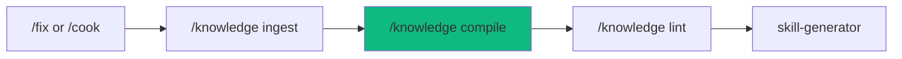

# /knowledge - The Knowledge Engine

$ARGUMENTS

---

## Purpose

Manage the project's living knowledge wiki. Raw signals from error fixes, user corrections, and architectural decisions are ingested, compiled into cross-linked concept articles by the LLM, and queryable for future coding decisions. Patterns are cached in `knowledge/patterns/` for fast agent lookup.

---

## Sub-Commands

| Command | Purpose | Example |
|---------|---------|---------|
| `/knowledge ingest` | Record a raw signal | `/knowledge ingest "CDP restart needs bat file on Windows"` |
| `/knowledge compile` | Compile unprocessed signals into articles | `/knowledge compile` |
| `/knowledge query` | Ask a question against the wiki | `/knowledge query "how does CDP restart work?"` |
| `/knowledge lint` | Run health checks on the wiki | `/knowledge lint` |
| `/knowledge status` | Show wiki statistics | `/knowledge status` |

---

## 🤖 Meta-Agents Integration

| Phase | Agent | Action |
|-------|-------|--------|
| **Ingest** | `learner` | Extract signal from recent fix/correction |
| **Compile** | `orchestrator` | Batch signals, route to compiler |
| **Lint** | `learner` | Generate health report |

---

## 🔴 MANDATORY: Knowledge Protocol

### Phase 0: Pre-flight & Auto-Learned Context

> **Rule 0.5-K:** Auto-learned pattern check.

1. Read `.agent/knowledge/patterns/` for past failures before proceeding.
2. Trigger `recovery` agent to run Checkpoint (`git commit -m "chore(checkpoint): pre-knowledge"`).


### Phase 0.5: Auto-Knowledge Ingest (Git Scanner)

> **Protocol:** `.agent/rules/auto-knowledge-ingest.md`
> **Channel 1:** Scans recent git commits for project-specific lessons.

```
1. Check if .agent/knowledge/ exists - if not, skip
2. Read _index.md - get last_git_scan SHA
3. Run: git log --since="7 days ago" --grep="^fix:|^feat:" -n 20
4. For qualifying commits (>=2 files changed OR keywords: fallback, guard, CORS, rate-limit):
   a. Skip if signal with same commit SHA exists
   b. Generate signal to raw-signals/SIG-{NNN}.md
5. Update last_git_scan in _index.md
6. If uncompiled signals > 5 - auto-compile (max 10 per batch)
```

### Phase 1: Ingest

| Field | Value |
|-------|-------|
| **INPUT** | Description of what happened + context |
| **OUTPUT** | Raw signal file in `.agent/knowledge/raw/` |
| **SKILLS** | `knowledge-compiler` |

1. Classify signal type: `error_fix` | `correction` | `decision` | `observation`
2. Extract structured data: signal, context, resolution, lesson
3. Write to `.agent/knowledge/raw/{YYYY-MM-DD}-{slug}.md` with frontmatter
4. Update `_index.md` uncompiled count
5. Output: `📥 Signal recorded: {slug}`

### Phase 2: Compile

| Field | Value |
|-------|-------|
| **INPUT** | Uncompiled signals in `raw/` (max 10 per batch) |
| **OUTPUT** | New/updated concept articles in `concepts/` |
| **SKILLS** | `knowledge-compiler` |

1. Read `_index.md` for current wiki state
2. Find signals where `compiled: false` (max 10)
3. Cluster related signals by tags
4. For each cluster:
   - Existing article? → Update with new insights
   - New topic? → Create concept article
   - Decision? → Create ADR in `decisions/`
5. Add `[[backlinks]]` between related articles
6. Mark processed signals as `compiled: true`
7. Regenerate `_index.md` and `_graph.md`
8. Output: `📚 Compiled: {N} signals → {M} articles`

### Phase 3: Query

| Field | Value |
|-------|-------|
| **INPUT** | Natural language question |
| **OUTPUT** | Answer citing wiki articles |
| **SKILLS** | `knowledge-compiler` |

1. Read `_index.md` for article summaries
2. Identify relevant articles by topic
3. Read full article(s)
4. Synthesize answer with citations
5. Output: Answer with `[[article-name]]` references

### Phase 4: Lint

| Field | Value |
|-------|-------|
| **INPUT** | Current wiki state |
| **OUTPUT** | Health report with score and recommendations |
| **SKILLS** | `knowledge-linter` |

1. Run 5 health checks: staleness, orphans, inconsistency, gaps, dead links
2. Calculate health score (0-100)
3. Generate recommendations sorted by priority
4. Output: Health report markdown

### Phase 5: Status

| Field | Value |
|-------|-------|
| **INPUT** | None |
| **OUTPUT** | Wiki statistics summary |
| **SKILLS** | `knowledge-compiler` |

1. Read `_index.md` statistics
2. Count files in `raw/`, `concepts/`, `decisions/`
3. Output: Quick statistics table

---

## Auto-Ingest Rules

> When to automatically record signals (no explicit `/knowledge ingest` needed):

| Trigger | Signal Type | Condition |
|---------|-------------|-----------|
| Multi-file fix | `error_fix` | Fix touched ≥ 3 files |
| User correction | `correction` | User says "wrong"/"fix this"/"broken" |
| Architecture decision | `decision` | ADR-worthy choice made during `/build` or `/plan` |
| Repeated error | `error_fix` | Same error class hit ≥ 2 times in session |

> Single-line fixes, typos, and formatting changes are NOT ingested.

---

## Output Format

```markdown
## 📚 Knowledge: {Operation}

### Result

| Metric | Value |
|--------|-------|
| Operation | {ingest/compile/query/lint/status} |
| Articles affected | {N} |
| Signals processed | {N} |

### Details

{Operation-specific output}

### Next Steps

- [ ] {Recommended follow-up action}
```

---

## 🔄 Rollback & Recovery

If compilation corrupts articles or produces invalid cross-links:
1. Restore from pre-knowledge checkpoint (`git checkout -- .agent/knowledge/`).
2. Re-run `/knowledge lint` to validate remaining wiki health.
3. Log failure via `learner` meta-agent.

> **Rule:** Raw signals in `raw/` are never deleted during compilation — they serve as the source of truth for recovery.

---

## → MANDATORY: Problem Verification Before Completion

> **CRITICAL:** This check MUST be performed before any `notify_user` or task completion.

### Check @[current_problems]

```
1. Read @[current_problems] from IDE
2. If errors/warnings > 0:
   a. Auto-fix: broken links, malformed frontmatter
   b. Re-check @[current_problems]
   c. If still > 0 → STOP → Notify user
3. If count = 0 → Proceed to completion
```

> **Note:** /knowledge produces markdown artifacts. This check applies to frontmatter formatting, link integrity, and index consistency.


---

## MANDATORY: Post-Completion Knowledge Check

> **Protocol:** `.agent/rules/auto-knowledge-ingest.md`
> **Channel 2:** AI self-reflects on session to capture non-trivial lessons.

```
1. Self-reflect: "Was this session non-trivial?"
   - Did I fix a multi-file bug?
   - Did I discover a framework/API gotcha?
   - Did I make an architectural decision?
   - Did I work around a platform limitation?
2. If ALL answers are NO - skip (trivial session)
3. If ANY answer is YES:
   a. Score significance (multi-file: +2, workaround: +3, API quirk: +3)
   b. If score >= 3 - generate signal to raw-signals/SIG-{NNN}.md
   c. If uncompiled signals > 5 - auto-compile
4. Proceed to "Suggest Next Workflow"
```

---

## ⏭️ MANDATORY: Suggest Next Workflow

> **After completing /knowledge, you MUST suggest the next pipeline step to the user.**

```
✅ /knowledge complete → Suggest: "Run `/knowledge lint` to verify wiki health."
```

---

## Examples

```
/knowledge ingest "CDP restart on Windows needs .bat intermediary because child process dies with parent"
/knowledge compile
/knowledge query "what are the known gotchas with process spawning?"
/knowledge lint
/knowledge status
```

---

## 🔗 Workflow Chain

**Skills Loaded (3):**

- `knowledge-compiler` — Signal ingestion, pattern learning, article compilation
- `knowledge-linter` — Wiki health checks
- `skill-generator` — Generate skills from mature articles



| After /knowledge | Run | Purpose |
|-----------------|-----|---------| 
| Compile done | `/knowledge lint` | Verify wiki health |
| Health issues | `/knowledge compile` | Recompile stale articles |
| Mature knowledge | `skill-generator` | Generate skills from wiki |

---

## Key Principles

- **Signals compound** — every fix makes the wiki smarter
- **LLM maintains the wiki** — humans rarely edit articles directly
- **Read before code** — agent checks `_index.md` before implementation
- **Batch discipline** — max 10 signals per compile to control token budget
- **Cross-link everything** — isolated knowledge is wasted knowledge

---

⚡ PikaKit v3.9.206
