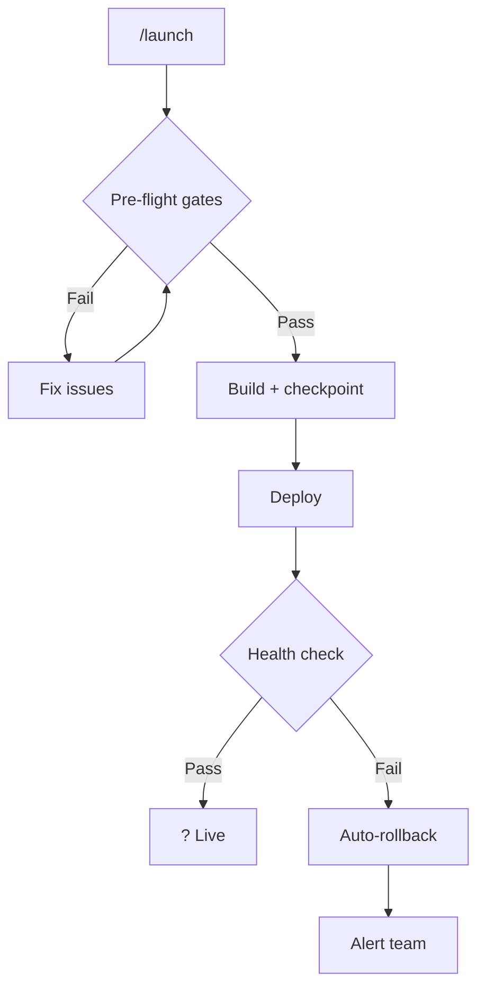
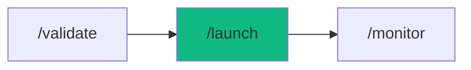

# /launch - Zero-Downtime Release

$ARGUMENTS

---

## Purpose

Production deployment with automated pre-flight checks, security scanning, build verification, health monitoring, and auto-rollback capability. **Differs from `/stage` (local development sandbox) and `/monitor` (production observability) by executing the full deployment pipeline with zero-downtime guarantees.** Uses `cicd-pipeline` with `cicd-pipeline` for deployment orchestration, `security-scanner` with `security-scanner` for pre-deploy validation, and `recovery` for rollback safety.

---

## Sub-Commands

| Command | Action |
|---------|--------|
| `/launch` | Interactive deployment wizard |
| `/launch check` | Run pre-flight checks only |
| `/launch preview` | Deploy to staging/preview |
| `/launch ship` | Deploy to production |
| `/launch rollback` | Rollback to previous version |
| `/launch rollback --to v2.0.3` | Rollback to specific version |
| `/launch rollback --list` | List available rollback points |

---

## 🤖 Meta-Agents Integration

| Phase | Agent | Action |
| ----- | ----- | ------ |
| **Pre-Flight** | `assessor` | Evaluate deployment risk and knowledge-compiler context |
| **Execution** | `orchestrator` | Coordinate deploy pipeline and health checks |
| **Safety** | `recovery` | Save state and recover/rollback from failed deployments |
| **Post-Launch** | `learner` | Log deployment telemetry and success/failure patterns |

```
Flow:
assessor.evaluate(risk) → recovery.save(checkpoint)
       ↓
pre-flight gates → build → deploy
       ↓
health check → pass? → learner.log(success)
       → fail
recovery.restore(checkpoint) → learner.log(failure)
```

---

## ⚡ MANDATORY: Deployment Protocol


### Phase 0: Dynamic Skill Detection

> **Protocol:** `.agent/rules/dynamic-skill-detection.md`

1. Scan `$ARGUMENTS` for domain signals (case-insensitive).
2. Match signals against the Domain Signal → Skill Mapping table.
3. Inject matched skills (max 5, priority: High > Medium > Low) into active skill set.
4. Skip skills already in workflow defaults.
5. Announce injected skills:

```
[⚡PikaKit] Dynamic Skills Detected:
  + {skill-name} (signal: "{matched keywords}")
  Base skills: [workflow defaults]
  Total active: [count]
```


### Phase 0.5: Auto-Knowledge Ingest (Git Scanner)

> **Protocol:** `.agent/rules/auto-knowledge-ingest.md`
> **Channel 1:** Scans recent git commits for project-specific lessons.

```
1. Check if .agent/knowledge/ exists — if not, skip
2. Read _index.md → get last_git_scan SHA
3. Run: git log --since="7 days ago" --grep="^fix:\|^feat:" -n 20
4. For qualifying commits (≥2 files changed OR keywords: fallback, guard, CORS, rate-limit):
   a. Skip if signal with same commit SHA exists
   b. Generate signal to raw-signals/SIG-{NNN}.md
5. Update last_git_scan in _index.md
6. If uncompiled signals > 5 → auto-compile (max 10 per batch)
```
### Phase 1: Pre-flight & knowledge-compiler Context

> **Rule 0.5-K:** knowledge-compiler pattern check.

1. Read `.agent/skills/knowledge-compiler/patterns/` for past failures before proceeding.
2. Trigger `recovery` agent to run Checkpoint (`git commit -m "chore(checkpoint): pre-launch"`).

### Phase 2: Pre-Flight Gates

| Field | Value |
|-------|-------|
| **INPUT** | $ARGUMENTS (sub-command + optional flags) |
| **OUTPUT** | Pre-flight result: all gates pass/fail with details |
| **AGENTS** | `security-scanner`, `assessor` |
| **SKILLS** | `security-scanner`, `code-review`, `context-engineering` |

**Gate 1: Code Quality**

// turbo — telemetry: phase-2-preflight
```bash
npx cross-env OTEL_SERVICE_NAME="workflow:launch" TRACE_ID="$TRACE_ID" npx tsc --noEmit; npx cross-env OTEL_SERVICE_NAME="workflow:launch" TRACE_ID="$TRACE_ID" npm run lint; npx cross-env OTEL_SERVICE_NAME="workflow:launch" TRACE_ID="$TRACE_ID" npm test
```

| Check | Required |
|-------|----------|
| TypeScript compiles | → |
| Linting passes | → |
| All tests pass | → |
| Build succeeds | → |

**Gate 2: Security**

| Check | Required |
|-------|----------|
| No hardcoded secrets | → |
| Dependencies audited | → |
| HTTPS configured | → |
| Environment variables set | → |

**Gate 3: Performance**

| Check | Threshold |
|-------|-----------|
| Lighthouse Score | > 80 |
| Bundle Size | < 500KB |
| First Contentful Paint | < 2s |

> If ANY gate fails → STOP → report blockers → do not deploy.

### Phase 3: Build & Checkpoint

| Field | Value |
|-------|-------|
| **INPUT** | All gates passed from Phase 2 |
| **OUTPUT** | Production build + git checkpoint tag |
| **AGENTS** | `cicd-pipeline`, `orchestrator` |
| **SKILLS** | `cicd-pipeline` |

1. `recovery` saves current state (git tag + commit hash)
2. Build production bundle

// turbo — telemetry: phase-3-build
```bash
npx cross-env OTEL_SERVICE_NAME="workflow:launch" TRACE_ID="$TRACE_ID" npm run build
```

3. Auto-detect platform (scan config files in priority order):

> **⚠️ IMPORTANT:** Do NOT assume a default platform. Scan the project root for config files and use the FIRST match from the table below. If no config file is found, ASK the user which platform to deploy to.

**Detection Priority (check in this order):**

```
1. Check for wrangler.toml / wrangler.json    → Cloudflare
2. Check for fly.toml                         → Fly.io
3. Check for vercel.json                      → Vercel
4. Check for netlify.toml                     → Netlify
5. Check for railway.toml / railway.json      → Railway
6. Check for Dockerfile                       → Docker-based (Railway/Fly)
7. Check for serverless.yml / template.yaml   → AWS
8. No config found                            → ASK user
```

| Platform | Config File(s) | Deploy Command | Rollback |
|----------|---------------|----------------|----------|
| **Cloudflare Pages** | `wrangler.toml` (Pages project) | `npx wrangler pages deploy <dist_dir> --project-name=<name>` | `npx wrangler pages deployment rollback` |
| **Cloudflare Workers** | `wrangler.toml` (`main =`) | `npx wrangler deploy` (from worker dir) | `npx wrangler rollback` |
| **Vercel** | `vercel.json` | `npx vercel --prod` | `npx vercel rollback` |
| **Fly.io** | `fly.toml` | `fly deploy` | `fly releases rollback` |
| **Netlify** | `netlify.toml` | `npx netlify deploy --prod` | Netlify dashboard |
| **Railway** | `railway.toml` | `railway up` | `railway rollback` |
| **AWS** | `template.yaml` / `serverless.yml` | `sam deploy` / `sls deploy` | Previous version redeploy |

**Cloudflare-specific notes:**
- If `wrangler.toml` exists, check for **both** Pages and Workers deployments
- For Pages: find project name via `npx wrangler pages project list`
- For Workers: find worker name from `name =` in `wrangler.toml`
- Use `--commit-dirty=true` flag if git has uncommitted changes
- A single project may have BOTH (e.g., frontend on Pages + API on Workers)

### Phase 4: Deploy & Health Check

| Field | Value |
|-------|-------|
| **INPUT** | Production build + platform config from Phase 3 |
| **OUTPUT** | Deployed application with health check result |
| **AGENTS** | `cicd-pipeline` |
| **SKILLS** | `cicd-pipeline`, `server-ops` |

1. Execute platform-specific deploy command
// turbo — telemetry: phase-4-deploy
2. Run health check (60s timeout):

| Check | Endpoint | Expected |
|-------|----------|----------|
| API Status | `GET /api/health` | 200 OK |
| Database | `GET /api/health/db` | 200 OK |
| Response Time | — | < 2000ms |

3. If health check fails → Phase 5 (Auto-Rollback)
4. If health check passes → `learner` logs deploy success

### Phase 5: Auto-Rollback (on failure only)

| Field | Value |
|-------|-------|
| **INPUT** | Failed health check from Phase 4 |
| **OUTPUT** | Reverted to previous version, rollback report |
| **AGENTS** | `cicd-pipeline`, `learner` |
| **SKILLS** | `cicd-pipeline`, `knowledge-compiler`, `problem-checker` |

1. `recovery` restores checkpoint
2. Re-deploy previous version
3. Verify rollback health
4. `learner` logs failure pattern



---

## → MANDATORY: Problem Verification Before Completion

> **CRITICAL:** This check MUST be performed before any `notify_user` or task completion.

### Check @[current_problems]

```
1. Read @[current_problems] from IDE
2. If errors/warnings > 0:
   a. Auto-fix: imports, types, lint errors
   b. Re-check @[current_problems]
   c. If still > 0 → STOP → Do NOT deploy
3. If count = 0 → Proceed to deployment
```

### Auto-Fixable

| Type | Fix |
|------|-----|
| Missing import | Add import statement |
| Unused variable | Remove or prefix `_` |
| Type mismatch | Fix type annotation |
| Lint errors | Run eslint --fix |

> **Rule:** Never deploy with errors in `@[current_problems]`.


---

## 📚 MANDATORY: Post-Completion Knowledge Check

> **Protocol:** `.agent/rules/auto-knowledge-ingest.md`
> **Channel 2:** AI self-reflects on session to capture non-trivial lessons.

```
1. Self-reflect: "Was this session non-trivial?"
   - Did I fix a multi-file bug?
   - Did I discover a framework/API gotcha?
   - Did I make an architectural decision?
   - Did I work around a platform limitation?
2. If ALL answers are NO → skip (trivial session)
3. If ANY answer is YES:
   a. Score significance (multi-file: +2, workaround: +3, API quirk: +3)
   b. If score ≥ 3 → generate signal to raw-signals/SIG-{NNN}.md
   c. If uncompiled signals > 5 → auto-compile
4. Proceed to "Suggest Next Workflow"
```

---

## ⏭️ MANDATORY: Suggest Next Workflow

> **After completing /launch, you MUST suggest the next pipeline step to the user.**

```
✅ /launch complete → Suggest: "Run `/monitor` to track production health."
```

---

## 🔄 Rollback & Recovery

If deployment automation fails completely or pre-flights break the workspace:
1. Fallback to manual deploy: trigger `recovery.restore()` and halt workflow.
2. Auto-rollback handles post-deployment health check failures (see Phase 5).
3. Log incident via `learner` meta-agent.

---

## Output Format

### Successful Launch

```markdown
## 🚀 Launch Complete

### Summary

| Metric | Value |
|--------|-------|
| Version | v2.1.0 |
| Environment | Production |
| Duration | 47 seconds |
| Platform | [auto-detected] |

### Pre-Flight Results

| Gate | Status |
|------|--------|
| TypeScript | → 0 errors |
| Tests | → 42/42 passed |
| Security | → No vulnerabilities |
| Build | → Success (234KB) |

### Health Check

| Check | Status |
|-------|--------|
| API | → 200 OK |
| Database | → Connected |
| Response | → < 2000ms |

### URLs

🌐 **Production:** https://app.example.com

### Next Steps

- [ ] Monitor for 24h with `/monitor`
- [ ] Run `/chronicle` to update documentation
- [ ] Rollback available: `/launch rollback`
```

### Failed Launch

```markdown
## → Launch Aborted

### Pre-Flight Failed

| Check | Result |
|-------|--------|
| TypeScript | → 3 errors |
| Tests | → Pass |
| Security | ⚠️ 1 warning |

### Blockers

1. TypeScript error in `src/api/user.ts:42`

### Next Steps

- [ ] Fix blockers with `/fix`
- [ ] Re-run `/launch` after fixes
```

---

## Examples

```
/launch
/launch check
/launch preview
/launch ship
/launch rollback
/launch rollback --to v2.0.3
```

---

## Key Principles

- **Never skip security** — always scan for vulnerabilities before deploy
- **Rollback-first** — checkpoint before deploy, auto-revert on failure
- **Health check** — verify after deploy with 60s timeout
- **Zero-downtime** — no user-facing interruption during deployment
- **Document changes** — update changelog and notify team automatically

---

## 🔗 Workflow Chain

**Skills Loaded (7):**

- `cicd-pipeline` - Deployment orchestration and rollback strategies
- `server-ops` - Server management and health monitoring
- `security-scanner` - Pre-deploy vulnerability scanning
- `code-review` - Code quality validation
- `context-engineering` - Codebase parsing and component mapping
- `problem-checker` - IDE problem verification
- `knowledge-compiler` - Auto-learning from deployment failures



| After /launch | Run | Purpose |
|--------------|-----|---------|
| Deploy success | `/chronicle` | Generate updated documentation |
| Deploy success | `/monitor` | Monitor production health |
| Deploy fail | `/diagnose` | Debug deployment issue |
| Need revert | `/launch rollback` | Rollback to previous version |

**Handoff to /monitor:**

```markdown
✅ Deployed v[version] to production! URL: [url].
Health check: ?. Run `/monitor` to track or `/chronicle` for docs.
```
